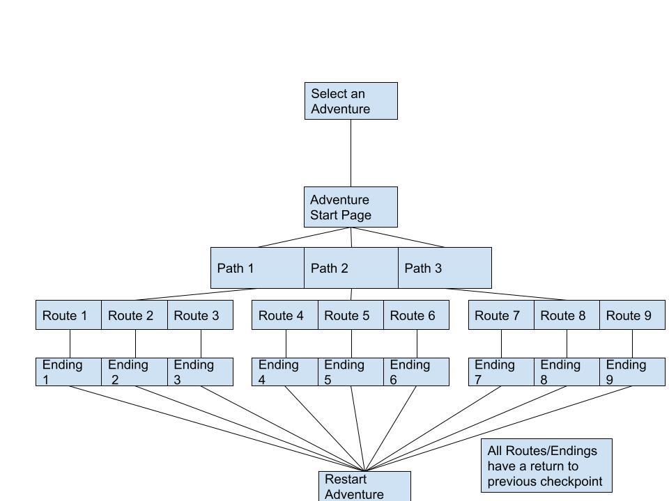

# FindingYourWay

**Creator**: LawrenceHau

Porto is a web app that was created using React to browse portfolios of all users in our own database created with Express. User can upload their own user information, project details, and images. A search feature is also available if our users are more interested in browsing the available works of other artists and creators, alike.

### Technology Used

- **React**: Utilized _HTML_, _CSS_, _JavaScript_ within the application to create functional components and aesthetically pleasing styling for a simple, modern design.
- **Bootstrap**: Implemented to create more fluid and structured styling throughout the app.
- **Heroku**: This web app was deployed using Heroku.

### Install Instructions

- Fork and Clone this repository, along with the porto-server to provide the backend data.

In your terminal after cloning, run:

**`npm install`** or **`npm i`**
**`npm run start`** or **`npm start`**

### Features

- Adventure page links to adventures.
- Path Page links to Routes.
- Routes Page links to Endings.
- Ending page displays data.

### Approach
I wanted to create an app that would resolve data from a backend built in Django, It allows the front end to render and link that information to go into each seperate page.

### Challenges

- A lot of refactoring of the backend to make sure that the pages would link properly
- Editing data on the backend would push the data to the bottom of the json, so linking directly was the optimal output method
- Originally had seperate Route and Path tables which would have stayed ideal, I would like to refactor it back to how I had the previous data set up.
- Life

## Structuring of Components

